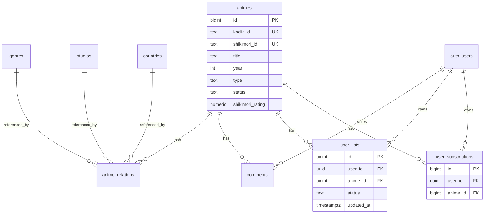

# Воссоздание Supabase для AniHub

## Анализ текущей структуры

Проект использует Supabase для:

- Хранения данных об аниме (каталог)
- Аутентификации пользователей (Email, Google, Spotify OAuth)
- Пользовательских списков и подписок
- Комментариев

### Архитектура данных



---

## Шаги выполнения

### 1. Создание нового Supabase проекта

1. Зайти на [supabase.com](https://supabase.com) и создать новый проект
2. Выбрать регион (рекомендуется: Frankfurt для EU)
3. Сохранить пароль базы данных
4. После создания, получить:

   - **Project URL** (например: `https://xxxxx.supabase.co`)
   - **anon/public key** (из Settings > API)

### 2. Обновление переменных окружения

Создать/обновить `.env.local`:

```env
NEXT_PUBLIC_SUPABASE_URL=https://YOUR_PROJECT_ID.supabase.co
NEXT_PUBLIC_SUPABASE_ANON_KEY=your_anon_key_here
```

### 3. Создание полной схемы базы данных

Существующая схема в [scripts/create-database-schema.sql](scripts/create-database-schema.sql) неполная. Нужно дополнить её двумя таблицами, которые используются в коде, но отсутствуют в SQL:

**Добавить таблицу `user_lists`** (используется в [app/api/lists/route.ts](app/api/lists/route.ts)):

```sql
CREATE TABLE user_lists (
  id BIGINT GENERATED BY DEFAULT AS IDENTITY PRIMARY KEY,
  user_id UUID NOT NULL REFERENCES auth.users(id) ON DELETE CASCADE,
  anime_id BIGINT NOT NULL REFERENCES animes(id) ON DELETE CASCADE,
  status TEXT NOT NULL, -- watching, completed, planned, dropped, on_hold
  updated_at TIMESTAMPTZ DEFAULT NOW(),
  UNIQUE(user_id, anime_id)
);

ALTER TABLE user_lists ENABLE ROW LEVEL SECURITY;
CREATE POLICY "users_read_own_lists" ON user_lists FOR SELECT USING (auth.uid() = user_id);
CREATE POLICY "users_insert_own_lists" ON user_lists FOR INSERT WITH CHECK (auth.uid() = user_id);
CREATE POLICY "users_update_own_lists" ON user_lists FOR UPDATE USING (auth.uid() = user_id);
CREATE POLICY "users_delete_own_lists" ON user_lists FOR DELETE USING (auth.uid() = user_id);
```

**Добавить таблицу `user_subscriptions`** (используется в [app/api/subscriptions/route.ts](app/api/subscriptions/route.ts)):

```sql
CREATE TABLE user_subscriptions (
  id BIGINT GENERATED BY DEFAULT AS IDENTITY PRIMARY KEY,
  user_id UUID NOT NULL REFERENCES auth.users(id) ON DELETE CASCADE,
  anime_id BIGINT NOT NULL REFERENCES animes(id) ON DELETE CASCADE,
  created_at TIMESTAMPTZ DEFAULT NOW(),
  UNIQUE(user_id, anime_id)
);

ALTER TABLE user_subscriptions ENABLE ROW LEVEL SECURITY;
CREATE POLICY "users_read_own_subs" ON user_subscriptions FOR SELECT USING (auth.uid() = user_id);
CREATE POLICY "users_insert_own_subs" ON user_subscriptions FOR INSERT WITH CHECK (auth.uid() = user_id);
CREATE POLICY "users_delete_own_subs" ON user_subscriptions FOR DELETE USING (auth.uid() = user_id);
```

### 4. Настройка аутентификации OAuth

В Supabase Dashboard > Authentication > Providers:

1. **Google OAuth**:

   - Включить Google provider
   - Создать OAuth credentials в [Google Cloud Console](https://console.cloud.google.com/)
   - Добавить `https://YOUR_PROJECT_ID.supabase.co/auth/v1/callback` в Authorized redirect URIs
   - Вставить Client ID и Client Secret в Supabase

2. **Spotify OAuth** (опционально):

   - Включить Spotify provider
   - Создать приложение в [Spotify Developer Dashboard](https://developer.spotify.com/dashboard)
   - Настроить redirect URI аналогично Google

### 5. Настройка Site URL

В Supabase Dashboard > Authentication > URL Configuration:

- Site URL: `http://localhost:3000` (для разработки)
- Redirect URLs: добавить `http://localhost:3000/auth/callback`

---

## Файлы для обновления

| Файл | Действие |

|------|----------|

| [scripts/create-database-schema.sql](scripts/create-database-schema.sql) | Добавить таблицы `user_lists` и `user_subscriptions` |

| `.env.local` | Обновить URL и ключ нового проекта |

---

## Порядок выполнения SQL

1. Выполнить полный скрипт `create-database-schema.sql` в SQL Editor Supabase
2. Добавить таблицы `user_lists` и `user_subscriptions`
3. Проверить создание всех индексов и RLS политик