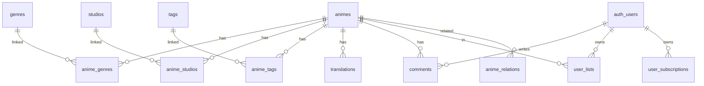

# AniHub - Эталонная архитектура

## Обзор системы

AniHub — аниме-каталог на Next.js 14 с данными из Kodik API, хранением в Supabase и авторизацией через Email/Google/Spotify.

```
┌─────────────────────────────────────────────────────────────────────────┐
│                            KODIK API                                     │
│         kodikapi.com/list?types=anime&with_material_data=true           │
└───────────────────────────────────┬─────────────────────────────────────┘
                                    │
                                    ▼
┌─────────────────────────────────────────────────────────────────────────┐
│                         PARSER (/api/parser)                            │
│  Извлекает: title, poster, description, genres, studios, translations   │
└───────────────────────────────────┬─────────────────────────────────────┘
                                    │
                                    ▼
┌─────────────────────────────────────────────────────────────────────────┐
│                            SUPABASE                                     │
├─────────────────────────────────────────────────────────────────────────┤
│  animes ──┬── anime_genres ── genres                                    │
│           ├── anime_studios ── studios                                  │
│           ├── anime_tags ── tags                                        │
│           ├── translations (player_link для Kodik iframe)               │
│           ├── comments ── auth.users                                    │
│           └── user_lists ── auth.users                                  │
└───────────────────────────────────┬─────────────────────────────────────┘
                                    │
                                    ▼
┌─────────────────────────────────────────────────────────────────────────┐
│                         NEXT.JS FRONTEND                                │
├─────────────────────────────────────────────────────────────────────────┤
│  /              → Hero + Карусели                                       │
│  /catalog       → Фильтры + пагинация                                   │
│  /anime/[id]    → Детальная страница                                    │
│  /anime/[id]/watch → Kodik Player                                       │
└─────────────────────────────────────────────────────────────────────────┘
```

---

## Схема базы данных

### Таблица `animes`

| Поле | Тип | Описание |
|------|-----|----------|
| `id` | BIGINT | Primary key |
| `shikimori_id` | TEXT | Уникальный ID Shikimori |
| `kodik_id` | TEXT | ID в Kodik |
| `title` | TEXT | Название на русском |
| `title_orig` | TEXT | Оригинальное название |
| `year` | INT | Год выпуска |
| `poster_url` | TEXT | URL постера |
| `description` | TEXT | Описание |
| `type` | TEXT | anime, anime-serial |
| `anime_kind` | TEXT | tv, movie, ova, ona, special |
| `status` | TEXT | anons, ongoing, released |
| `episodes_count` | INT | Общее количество эпизодов |
| `episodes_aired` | INT | Вышедшие эпизоды |
| `episodes_total` | INT | Запланировано эпизодов |
| `shikimori_rating` | NUMERIC(3,1) | Рейтинг Shikimori |
| `shikimori_votes` | INT | Количество голосов |
| `screenshots` | JSONB | Скриншоты |
| `is_featured_in_hero` | BOOLEAN | Показывать в Hero-слайдере |
| `ts_document` | TSVECTOR | Полнотекстовый поиск |
| `updated_at_kodik` | TIMESTAMPTZ | Дата обновления в Kodik |

### Справочники

| Таблица | Поля |
|---------|------|
| `genres` | id, name, slug |
| `studios` | id, name, slug |
| `tags` | id, name, slug |
| `countries` | id, name |

### Связующие таблицы

| Таблица | Связь |
|---------|-------|
| `anime_genres` | anime_id → genre_id |
| `anime_studios` | anime_id → studio_id |
| `anime_tags` | anime_id → tag_id |
| `anime_countries` | anime_id → country_id |
| `anime_relations` | anime_id → related_id (сиквелы, приквелы) |

### Таблица `translations` (озвучки)

| Поле | Тип | Описание |
|------|-----|----------|
| `id` | BIGINT | Primary key |
| `anime_id` | BIGINT | FK → animes |
| `kodik_translation_id` | INT | ID озвучки в Kodik |
| `title` | TEXT | Название озвучки |
| `type` | TEXT | voice, subtitles |
| `player_link` | TEXT | Ссылка на плеер Kodik |
| `quality` | TEXT | 720p, 1080p |

### Пользовательские таблицы

| Таблица | Назначение |
|---------|------------|
| `user_lists` | Списки: watching, completed, planned, dropped, on_hold |
| `user_subscriptions` | Подписки на уведомления о новых сериях |
| `comments` | Комментарии к аниме |

---

## Поток данных из Kodik API

### Запрос к Kodik `/list`

```
GET https://kodikapi.com/list
  ?token=YOUR_TOKEN
  &types=anime,anime-serial
  &with_material_data=true
  &limit=100
```

### Маппинг полей Kodik → Supabase

```
Kodik Response                    →  Supabase Table
─────────────────────────────────────────────────────
shikimori_id                      →  animes.shikimori_id
title                             →  animes.title
title_orig                        →  animes.title_orig
year                              →  animes.year
type                              →  animes.type
link                              →  translations.player_link
translation.id                    →  translations.kodik_translation_id
translation.title                 →  translations.title
translation.type                  →  translations.type
screenshots[]                     →  animes.screenshots
updated_at                        →  animes.updated_at_kodik

material_data.anime_poster_url    →  animes.poster_url
material_data.anime_description   →  animes.description
material_data.anime_status        →  animes.status
material_data.anime_genres[]      →  genres + anime_genres
material_data.anime_studios[]     →  studios + anime_studios
material_data.countries[]         →  countries + anime_countries
material_data.shikimori_rating    →  animes.shikimori_rating
material_data.shikimori_votes     →  animes.shikimori_votes
```

---

## API Endpoints

### Публичные

| Endpoint | Метод | Описание |
|----------|-------|----------|
| `/api/catalog` | GET | Каталог с фильтрами и пагинацией |
| `/api/anime/[id]` | GET | Детальная информация об аниме |
| `/api/search` | GET | Полнотекстовый поиск (ts_document) |
| `/api/genres` | GET | Список жанров |
| `/api/studios` | GET | Список студий |
| `/api/comments` | GET | Комментарии к аниме |

### Требуют авторизации

| Endpoint | Метод | Описание |
|----------|-------|----------|
| `/api/lists` | POST | Добавить/обновить аниме в список пользователя |
| `/api/subscriptions` | POST/GET | Управление подписками |
| `/api/comments` | POST | Добавить комментарий |

### Административные

| Endpoint | Метод | Описание |
|----------|-------|----------|
| `/api/parser` | POST | Парсинг нескольких страниц Kodik |
| `/api/parse-single-page` | POST | Парсинг одной страницы |

---

## View `animes_with_details`

Используется в `/api/catalog` для оптимизации запросов:

```sql
CREATE VIEW animes_with_details AS
SELECT 
  a.*,
  (SELECT json_agg(json_build_object('id', g.id, 'name', g.name, 'slug', g.slug))
   FROM anime_genres ag JOIN genres g ON ag.genre_id = g.id
   WHERE ag.anime_id = a.id) AS genres_json,
  (SELECT json_agg(json_build_object('id', s.id, 'name', s.name, 'slug', s.slug))
   FROM anime_studios ast JOIN studios s ON ast.studio_id = s.id
   WHERE ast.anime_id = a.id) AS studios_json
FROM animes a;
```

---

## RLS Политики

| Таблица | Чтение | Запись |
|---------|--------|--------|
| `animes`, `genres`, `studios`, `tags` | Все | service_role |
| `translations` | Все | service_role |
| `user_lists` | Только владелец | Только владелец |
| `user_subscriptions` | Только владелец | Только владелец |
| `comments` | Все | Авторизованные (свои) |

---

## Переменные окружения

```env
# Supabase
NEXT_PUBLIC_SUPABASE_URL=https://xxx.supabase.co
NEXT_PUBLIC_SUPABASE_ANON_KEY=eyJhbGci...

# Kodik API
KODIK_API_TOKEN=your_token_here
```

---

## Диаграмма связей


